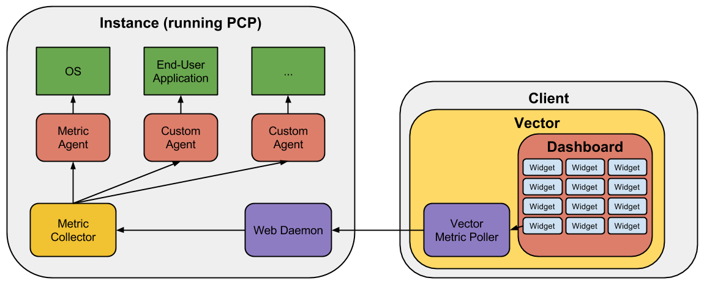

# Vector

Vector is an open source host-level performance monitoring framework which exposes hand-picked, high-resolution system and application metrics to every engineer’s browser. Having the right metrics available on demand and at a high resolution is key to understanding how a system behaves and correctly troubleshooting performance issues. Logging onto a system and running a large number of commands from the shell is an option, but the complexity typically involved can be a barrier for engineers wishing to adopt it as a long-term solution. Also, traditional centralized system monitoring solutions are often complex to set up, especially for one-off or ad-hoc usage, where such solutions would be an overkill.

Vector provides a simple way for users to visualize and analyze system and application-level metrics in near real-time. It leverages the battle tested open source system monitoring framework, Performance Co-Pilot (PCP),  layering on top a flexible and user-friendly UI. The UI polls metrics at up to 1 second resolution, rendering the data in completely configurable dashboards that simplify cross-metric correlation and analysis.
PCP’s stateless model makes it lightweight and robust. Its overhead on hosts is negligible as clients are responsible for keeping track of state, sampling rate, and computation. Additionally, metrics are not aggregated across hosts or persisted outside of the user’s browser session, keeping the framework light. Vector requires only your local browser and PCP installed on the host you wish to monitor. No intermediate collector, server, or database infrastructure is required.

## Architecture

Vector itself is a web application that runs completely inside the user's browser. It was built with [AngularJS](https://angularjs.org/) and leverages [D3.js](http://d3js.org/) for charting. In the future, the Vector package will also include custom metric agents.

Vector has a “default” dashboard exposed at launch.  This dashboard is a simple page that holds a few options including UI object visibility flags, widget definitions, and a set of loaded widgets. Once loaded, it will display the set of loaded widgets and present the user with controls to include any of the additional predefined widgets.

Widgets are loaded into dashboards. A widget object will contain details about a specific widget, like it’s name, template, style, and more importantly, the data model to be used. Data models are, in a nutshell, objects that control the metrics required for each widget and how the values are used in it. Data model prototypes are relatively simple. They extend a base WidgetDataModel prototype and define their own init and destroy functions. Most of what is done in those functions is adding and removing metrics from the metric poller list, creating callback functions that deal with the data points returned from the poller itself, and referencing the right data structure to be used in the charts.

Generic data models were also created so they could be reused on new widgets without having to create a specific data model for it.

* **DummyMetricDataModel**. Polls a dummy metric from Performance Co-Pilot in order to avoid losing the application context. It can be used with widgets that don't require a metric from PCP.
* **MetricTimeSeriesDataModel**. Polls a single metric and stores the value in a D3 compatible time series data structure.
* **CumulativeMetricTimeSeriesDataModel**. Same as MetricTimeSeriesDataModel, but applies a commulative function to the value.
* **CumulativeUtilizationMetricTimeSeriesDataModel**. Same as CumulativeMetricTimeSeriesDataModel, but applies a normalization function to the value.
* **MultipleMetricTimeSeriesDataModel**. Same as MetricTimeSeriesDataModel, but accepts multiple metrics and combines the values into a single data structure.
* **MultipleCumulativeMetricTimeSeriesDataModel**. Same as CumulativeMetricTimeSeriesDataModel, but accepts multiple metrics and combines the values into a single data structure.

Metrics are polled from Performace Co-Pilot's web daemon. They are referenced by unique names and current values are returned with a timestamp in order for them to be normalized.Vector makes use of two data structures to store metrics and their values. The "raw" metric data structure holds the original metric values that came from PCP. The "derived" metric data structure holds metrics that were modified by a data model function, like a cumulative function or a normalization function.

The metric poller is the component that goes over the list of "raw" metrics and polls them from PCP via HTTP, given the selected polling interval. It also executes all data model functions and consequently updates the "derived" metric data structure. Charts are automatically updated every time the data structure is updated.

Performance Co-Pilot (PCP) is a system performance and analysis framework. It provides metric agents, a metric collector and a web daemon that is leveraged by the metric poller to collect metric values. More details about PCP can be found at [pcp.io](http://pcp.io/documentation.html).
